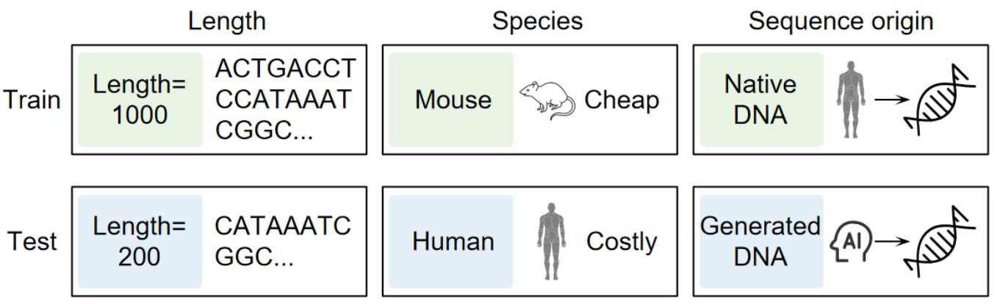

# Towards Robust Genomic Prediction under Distribution Shifts via Visual DNA Modeling

Official code release fo **Towards Robust Genomic Prediction under Distribution Shifts via Visual DNA Modeling (ShiftGeno)**

[](https://www.python.org/downloads/) [](https://github.com/mapengsen/ShiftGeno/blob/main/LICENSE) [](https://github.com/mapengsen/ShiftGeno/commits/main/) [](https://github.com/mapengsen/ShiftGeno)

[](https://mapengsen.github.io/ShiftGeno/)



---

The rander data code you can refer to the code : [github.com/HongxinXiang/OpticalDNA](https://github.com/HongxinXiang/OpticalDNA)

## 📁 Repository Structure

```text
ShiftGeno/
├── data_extension_split/           # Dashing similarity, OOD splitting, and GB materialization
│   ├── DNA_similarity/             # Similarity ranking and low-similarity splitting
│   ├── download_genomic_benchmarks_references.py
│   └── materialize_low_similarity_split_to_visualdna_raw.py
├── scripts/
│   ├── data_prep/                  # NT/GB data preparation
│   └── train_nt_image.py           # Shared training/evaluation entry point for NT and GB
├── requirements.txt
├── THIRD_PARTY_NOTICES.md
└── LICENSE
```

## ⚙️ Environment Setup

```bash
conda create --name shiftgeno python=3.12 --yes
conda activate shiftgeno
pip install torch==2.6.0 torchvision==0.21.0 \
  --index-url https://download.pytorch.org/whl/cu118
pip install --requirement requirements.txt
```

### Install Dashing(Optional installation)

Dashing is required only when recomputing the low-similarity splits. You may skip this section if you use the materialized Parquet files directly. Building Dashing from source requires Git, GNU Make, OpenMP, and a C++17-compatible compiler.

```bash
sudo apt-get update
sudo apt-get install \
  --yes \
  build-essential \
  git
git clone --recursive https://github.com/dnbaker/dashing.git third_party/dashing
git -C third_party/dashing checkout 0635bea4c779ff1628da3caf0a7d5fc0ce534967
git -C third_party/dashing submodule update \
  --init \
  --recursive
make -C third_party/dashing dashing -j"$(nproc)"
test -x third_party/dashing/dashing
```

## 🧬 Dataset Preparation

Run all commands from the repository root to reprocess the dataset.

### 1. Download the NT-Revised Source Data

```bash
hf download InstaDeepAI/nucleotide_transformer_downstream_tasks_revised \
  --repo-type dataset \
  --revision 851f9946252e90c665cdb3cc3eedb78f1f26197c \
  --local-dir data/raw_download/nucleotide_transformer_downstream_tasks_revised
```

### 2. Download the GB Interval Index Source Data

```bash
hf download katielink/genomic-benchmarks \
  --repo-type dataset \
  --revision 37c8b9e9da6c7690180e47fcb87ba741001d1338 \
  --local-dir data/raw_download/GB_github_index_metayml/datasets
```

### 3. Download the GB Reference FASTA Files

```bash
python data_extension_split/download_genomic_benchmarks_references.py \
  --datasets-root data/raw_download/GB_github_index_metayml/datasets \
  --reference-cache-dir data/raw_download/GB_github_index_metayml \
  --no-refresh-metadata \
  --dataset demo_coding_vs_intergenomic_seqs \
  --dataset demo_human_or_worm \
  --dataset human_enhancers_cohn \
  --dataset human_enhancers_ensembl \
  --dataset human_ensembl_regulatory \
  --dataset human_nontata_promoters \
  --dataset human_ocr_ensembl
```

### 4. Build the Original-Length Indexed CSV Files for GB

```bash
python scripts/data_prep/build_raw_genomic_benchmarks_indexed_csv.py \
  --datasets-root data/raw_download/GB_github_index_metayml/datasets \
  --reference-cache-dir data/raw_download/GB_github_index_metayml \
  --output-root data/processed_download/ood_imageDNA/original_indexed_sequences/genomic_benchmarks \
  --dataset demo_coding_vs_intergenomic_seqs \
  --dataset demo_human_or_worm \
  --dataset human_enhancers_cohn \
  --dataset human_enhancers_ensembl \
  --dataset human_ensembl_regulatory \
  --dataset human_nontata_promoters \
  --dataset human_ocr_ensembl
```

### 5. Compute Dashing Top-1 Similarity

NT:

```bash
python data_extension_split/DNA_similarity/rank_merged_nt_sample_similarity.py \
  --dataset nt \
  --nt-root data/raw_download/nucleotide_transformer_downstream_tasks_revised \
  --k 6 \
  --dashing-sketch-size 14 \
  --output-dir data/all_nt_original_no_dedup_dashing_k6
```

GB:

```bash
python data_extension_split/DNA_similarity/rank_merged_nt_sample_similarity.py \
  --dataset genomic_benchmarks \
  --genomic-benchmarks-root data/processed_download/ood_imageDNA/original_indexed_sequences/genomic_benchmarks \
  --k 6 \
  --dashing-sketch-size 14 \
  --output-dir data/all_gb_original_no_dedup_dashing_k6
```

Dashing uses all available CPU cores by default. Add `--score-workers <number>` only when you need to limit the number of threads. Add `--resume-from-partial` to resume an interrupted run.

### 6. Split the Data into Train/Validation/Test Sets

NT:

```bash
python data_extension_split/DNA_similarity/split_groups_by_low_similarity.py \
  --input-dir data/all_nt_original_no_dedup_dashing_k6/by_group \
  --output-root data/all_nt_original_no_dedup_dashing_k6/low_similarity_split \
  --holdout-fraction 0.2 \
  --seed 42
```

GB:

```bash
python data_extension_split/DNA_similarity/split_groups_by_low_similarity.py \
  --input-dir data/all_gb_original_no_dedup_dashing_k6/by_group \
  --output-root data/all_gb_original_no_dedup_dashing_k6/low_similarity_split \
  --holdout-fraction 0.2 \
  --seed 42
```

The 20% least-similar samples are stratified by label and divided equally between the validation and test sets. The remaining samples form the training set.

### 7. Convert the Data to Training-Ready Parquet Files

NT:

```bash
python scripts/data_prep/materialize_raw_nt_low_similarity_split_to_visualdna_raw.py \
  --nt-root data/raw_download/nucleotide_transformer_downstream_tasks_revised \
  --nt-low-split-root data/all_nt_original_no_dedup_dashing_k6/low_similarity_split \
  --output-root data/low_similarity_sequence_csv_original_parquet/nt \
  --output-format parquet
```

GB:

```bash
python data_extension_split/materialize_low_similarity_split_to_visualdna_raw.py \
  --dataset genomic_benchmarks \
  --gb-indexed-root data/processed_download/ood_imageDNA/original_indexed_sequences/genomic_benchmarks \
  --gb-low-split-root data/all_gb_original_no_dedup_dashing_k6/low_similarity_split \
  --output-root data/low_similarity_sequence_csv_original_parquet/genomic_benchmarks \
  --output-format parquet
```

Unified directory layout:

```text
data/low_similarity_sequence_csv_original_parquet/
├── nt/<task>/raw/<task>.parquet
└── genomic_benchmarks/<task>/raw/<task>.parquet
```

The required training columns are `index`, `seq`, `label`, and `split`. The materialization scripts also retain traceability fields such as `sample_id` and `source_split`.

## 🚀 Training and evaluation

### Train All NT-DS Tasks on 8 GPUs

```bash
CUDA_VISIBLE_DEVICES=0,1,2,3,4,5,6,7 torchrun --nproc_per_node 8 scripts/train_nt_image.py \
  --task-name all \
  --dataset-root data/low_similarity_sequence_csv_original_parquet/nt \
  --render-root data/render_images/nt \
  --output-dir outputs/ood/nt_all
```

### Train All GB-DS Tasks on 8 GPUs

```bash
CUDA_VISIBLE_DEVICES=0,1,2,3,4,5,6,7 torchrun --nproc_per_node 8 scripts/train_nt_image.py \
  --task-name all \
  --dataset-root data/low_similarity_sequence_csv_original_parquet/genomic_benchmarks \
  --render-root data/render_images/genomic_benchmarks \
  --output-dir outputs/ood/gb_all
```

### Evaluation

```bash
CUDA_VISIBLE_DEVICES=0 python scripts/train_nt_image.py \
  --task-name all \
  --dataset-root data/low_similarity_sequence_csv_original_parquet/nt \
  --render-root data/render_images/nt \
  --output-dir outputs/ood/nt_eval \
  --eval-only \
  --checkpoint-path "outputs/ood/nt_all/{task_name}/checkpoints/best.pt"
```

## 🙏 Acknowledgments

- [Nucleotide Transformer revised downstream tasks](https://huggingface.co/datasets/InstaDeepAI/nucleotide_transformer_downstream_tasks_revised)
- [Genomic Benchmarks](https://github.com/ML-Bioinfo-CEITEC/genomic_benchmarks)
- [Dashing](https://github.com/dnbaker/dashing)

When publishing work that uses these datasets or tools, please cite their original papers and licenses.
